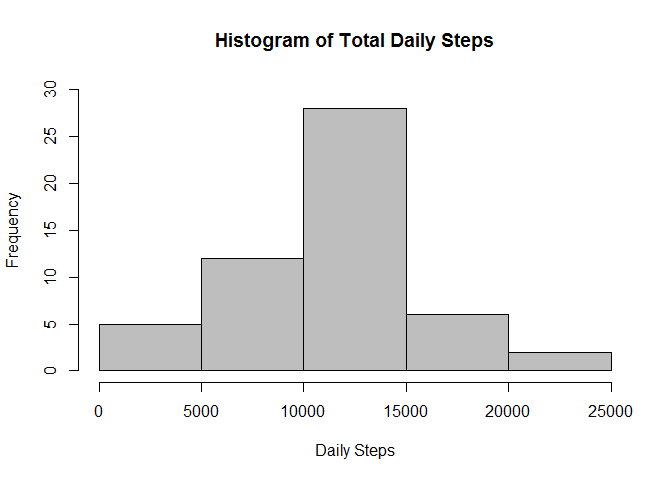
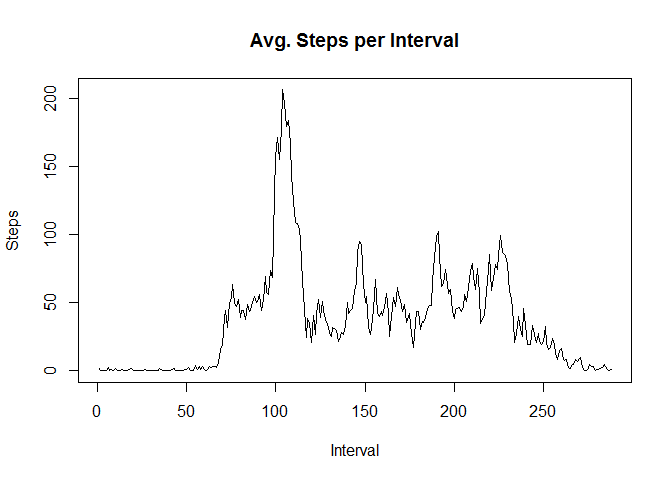
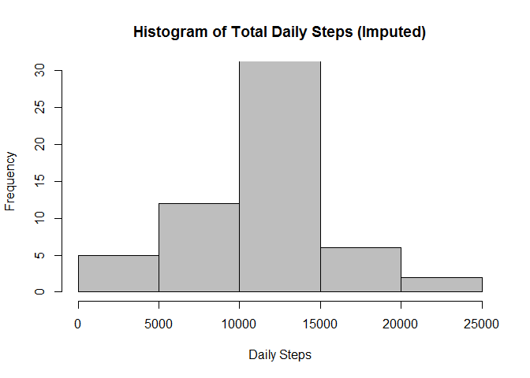
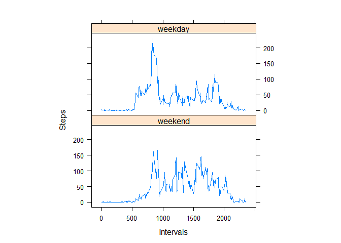

## Reproducible Research: Peer Assessment 1


###  Loading and preprocessing the data

1. Load the data


```r
## only download the file and run unzip if the file doesn't already exist
if(!file.exists("activity.csv")) {
  url <- "http://d396qusza40orc.cloudfront.net/repdata%2Fdata%2Factivity.zip"
  download.file(url, "repdata-data-activity.zip", mode="wb")
  unzip("repdata-data-activity.zip")
}
```

2. Process/transform the data (if necessary) into a format suitable for your analysis


```r
activity <- read.csv("activity.csv")
```


###  What is mean total number of steps taken per day?

1. Calculate the total number of steps taken "per day"


```r
steps.TotalByDate <- aggregate(activity$steps, by=list(Date=activity$date), FUN=sum, na.rm=TRUE)

steps.TotalByDate <- aggregate(steps ~ date, data=activity, sum, na.rm=TRUE)
```

2. Make a histogram of the total number of "steps taken each day"


```r
hist(steps.TotalByDate$steps, xlab="Daily Steps", main="Histogram of Total Daily Steps", ylim=c(0,30), col="gray")
```

 

3. Calculate and report the "mean and median" of the total number of steps taken "per day"


```r
mean(steps.TotalByDate$steps, na.rm=TRUE)
```

```
## [1] 10766.19
```

```r
## mean is shown above
```

```r
median(steps.TotalByDate$steps, na.rm=TRUE)
```

```
## [1] 10765
```

```r
## median is shown above
```


###  What is the average daily activity pattern?

1. Make a time series plot (i.e. type = "l") of the 5-minute interval (x-axis) and the average number of steps taken, averaged across all days (y-axis)


```r
steps.MeanByInterval <- tapply(activity$steps, activity$interval, mean, na.rm=TRUE)
plot(steps.MeanByInterval, type="l", main="Avg. Steps per Interval", ylab="Steps", xlab="Interval")
```

 

2. Which 5-minute interval, on average across all the days in the dataset, contains the maximum number of steps?


```r
#finds interval & avg.
steps.MeanByInterval.MaxValue <- steps.MeanByInterval[which.max(steps.MeanByInterval)]
### 835 & 206.1698

#find index of interval
which(steps.MeanByInterval %in% steps.MeanByInterval.MaxValue)
```

```
## [1] 104
```

```r
### 104
```
**Ans: Interval 835 (104th in the series).**


###  Imputing missing values

1. Calculate and report the total number of missing values in the dataset (i.e. the total number of rows with NAs)


```r
sum(as.numeric(is.na(activity$steps)))
```

```
## [1] 2304
```

```r
### 2304
```
**Ans: 2304 rows are missing.**

2. Devise a strategy for filling in all of the missing values in the dataset. The strategy does not need to be sophisticated. For example, you could use the mean/median for that day, or the mean for that 5-minute interval, etc


```r
# make two vector w/ identical length as the activities by interval series

## vector one contains mean per interval repeated 61 times, if mean = 0, set value to 1
vec_Steps.MeanByInterval <- as.vector(steps.MeanByInterval)
vec_Steps.Means <- rep(vec_Steps.MeanByInterval,61)
vec_Steps.Means[!is.na(activity$steps)] = 1

## vector two contains actual 61 days of interval values, if step = na, set value to 1
vec_Steps <- as.vector(activity$steps)
vec_Steps[is.na(vec_Steps)] = 1
```

3. Create a new dataset that is equal to the original dataset but with the missing data filled in.


```r
## multiply & create! 
activity$stepsbymean <- vec_Steps.Means * vec_Steps
```

4. Make a histogram of the total number of steps taken each day and Calculate and report the mean and median total number of steps taken per day. 


```r
steps.TotalByDate.Imputed <- aggregate(stepsbymean ~ date, data=activity, sum, na.rm=TRUE)

hist(steps.TotalByDate.Imputed$stepsbymean, xlab="Daily Steps", main="Histogram of Total Daily Steps (Imputed)", ylim=c(0,30), col="gray")
```

 

```r
mean(steps.TotalByDate$steps, na.rm=TRUE)
```

```
## [1] 10766.19
```

```r
## original mean value is shown above
```

```r
mean(steps.TotalByDate.Imputed$stepsbymean)
```

```
## [1] 10766.19
```

```r
## imputed mean value is shown above
```

```r
median(steps.TotalByDate$steps, na.rm=TRUE)
```

```
## [1] 10765
```

```r
## original median value is shown above
```

```r
median(steps.TotalByDate.Imputed$stepsbymean)
```

```
## [1] 10766.19
```

```r
## imputed median value is shown above
```

* 4a. Do these values differ from the estimates from the first part of the assignment? 

* **Ans: Means and median from the estimates (imputed) stayed relatively the same as the original data set.**

* 4b. What is the impact of imputing missing data on the estimates of the total daily number of steps?

* **Ans: The frequency of the mean values increased because the imputing process replaced NA values with mean.**

###  Are there differences in activity patterns between weekdays and weekends?

1. Create a new factor variable in the dataset with two levels - "weekday" and "weekend" indicating whether a given date is a weekday or weekend day.


```r
## create new column containing weekend or weekday value
## ref: http://stackoverflow.com/a/28893302
activity$date <- as.Date(activity$date)
weekdays1 <- c('Monday', 'Tuesday', 'Wednesday', 'Thursday', 'Friday')
activity$WeekDayType <- factor((weekdays(activity$date) %in% weekdays1), levels=c(FALSE, TRUE), labels=c('weekend', 'weekday'))
```

2. Make a panel plot containing a time series plot (i.e. type = "l") of the 5-minute interval (x-axis) and the average number of steps taken, averaged across all weekday days or weekend days (y-axis). See the README file in the GitHub repository to see an example of what this plot should look like using simulated data.


```r
library(lattice)
## create new data set through aggregating interval & weekday type
activity.imputed <- aggregate(stepsbymean ~ interval + WeekDayType, activity, mean)
xyplot(stepsbymean ~ interval | factor(WeekDayType), data=activity.imputed, type = "l", ylab="Steps", xlab="Intervals", aspect=1/2)
```

 


